# functorOS

A highly experimental NixOS-based Linux distribution, descended from liminalOS.

Currently under heavy development and not suitable for daily use. Please see
[the project wiki](https://code.functor.systems/functor.systems/functorOS/wiki) for more details.

See [os.functor.systems](https://os.functor.systems/) for module options.

## Try it

functorOS is ready for power users to test drive. You first need to install
NixOS on your desired machine. To install functorOS, run the following command
and look inside `flake.nix`, containing a minimal self-documenting
configuration for functorOS.

```sh
nix flake init -t "git+https://code.functor.systems/functor.systems/functorOS"
```

## Technical overview

```mermaid
flowchart TB
    subgraph Core
        NixOS[NixOS Base System]
        SysCore["System Core"]:::core
        BuildTools["System Building Tools"]:::core
    end

    subgraph PlatformModules
        direction TB
        Linux["Linux Modules"]:::linux
        Darwin["Darwin Modules"]:::darwin

        subgraph LinuxComponents
            direction TB
            Audio["Audio System"]:::linux
            Gaming["Gaming Support"]:::linux
            Graphics["Graphics System"]:::linux
            Network["Networking"]:::linux
            Theme["Theming System"]:::linux
        end
    end

    subgraph HomeManager
        direction TB
        HMCore["Home Manager Core"]:::hm
        Desktop["Desktop Environment"]:::hm
        Shell["Shell Environment"]:::hm
        Platform["Platform-Specific Tweaks"]:::hm
        DarwinHome["Darwin-Specific Home"]:::darwin
    end

    subgraph ConfigLayer
        direction TB
        HostConfig["Host Configurations"]:::config
        UserConfig["User Configurations"]:::config
        Secrets["Secrets Management"]:::security
        Pkgs["Package Management"]:::pkg
    end

    %% Relationships
    NixOS --> SysCore
    SysCore --> Linux
    SysCore --> Darwin
    BuildTools --> HostConfig
    
    Linux --> LinuxComponents
    Linux --> Desktop
    Darwin --> DarwinHome

    HMCore --> Shell
    HMCore --> Platform
    HMCore --> Desktop

    HostConfig --> UserConfig
    UserConfig --> Secrets
    Pkgs --> HostConfig

    %% Click Events
    click SysCore "https://github.com/youwen5/liminalos/tree/main/modules/linux/core/"
    click BuildTools "https://github.com/youwen5/liminalos/blob/main/lib/buildLiminalOS.nix"
    click Linux "https://github.com/youwen5/liminalos/tree/main/modules/linux/"
    click Darwin "https://github.com/youwen5/liminalos/tree/main/modules/darwin/"
    click Audio "https://github.com/youwen5/liminalos/tree/main/modules/linux/audio/"
    click Gaming "https://github.com/youwen5/liminalos/tree/main/modules/linux/gaming/"
    click Graphics "https://github.com/youwen5/liminalos/tree/main/modules/linux/graphics/"
    click Network "https://github.com/youwen5/liminalos/tree/main/modules/linux/networking/"
    click Theme "https://github.com/youwen5/liminalos/tree/main/modules/linux/stylix/"
    click HMCore "https://github.com/youwen5/liminalos/tree/main/hm/modules/common/"
    click Desktop "https://github.com/youwen5/liminalos/tree/main/hm/modules/linux/desktop-environment/"
    click Shell "https://github.com/youwen5/liminalos/tree/main/hm/modules/common/shellenv/"
    click Platform "https://github.com/youwen5/liminalos/tree/main/hm/modules/linux/platform-tweaks/"
    click DarwinHome "https://github.com/youwen5/liminalos/blob/main/hm/modules/darwin/darwin-home.nix"
    click HostConfig "https://github.com/youwen5/liminalos/tree/main/reference/hosts/"
    click UserConfig "https://github.com/youwen5/liminalos/tree/main/reference/users/"
    click Secrets "https://github.com/youwen5/liminalos/tree/main/reference/secrets/"
    click Pkgs "https://github.com/youwen5/liminalos/tree/main/pkgs/"

    %% Styling
    classDef core fill:#2196F3,stroke:#1565C0,color:white
    classDef linux fill:#4CAF50,stroke:#2E7D32,color:white
    classDef darwin fill:#9C27B0,stroke:#6A1B9A,color:white
    classDef hm fill:#FF9800,stroke:#EF6C00,color:white
    classDef config fill:#795548,stroke:#4E342E,color:white
    classDef security fill:#F44336,stroke:#C62828,color:white
    classDef pkg fill:#607D8B,stroke:#37474F,color:white

```



## Reference implementations

- Minimal template --- see [Try it](#try-it).
- @youwen --- [shezhi](https://code.functor.systems/youwen/shezhi). An advanced functorOS deployment featuring multiple hosts, additional flake inputs, custom configurations, and secret management.
