# liminalOS

This is a repository that implements liminalOS, my personal Linux distribution
based on [NixOS](https://nixos.org/). The most overengineered personal
computing environment, ever. Imagine having to `vim` into source code and
recompile an entire operating system to change a font. Yes, I use this on a
daily basis.

A flowchart of the system is provided below:

```mermaid
flowchart TB
    subgraph "Core System Layer"
        NixOS["NixOS/Darwin Base"]
        SysMod["System Modules"]:::sysmod
        HM["Home Manager"]:::hm
    end

    subgraph "Platform Modules"
        subgraph "Linux Modules"
            LinuxCore["Linux Core"]:::linux
            Desktop["Desktop Environment"]:::linux
            Audio["Audio System"]:::linux
            Gaming["Gaming Support"]:::linux
            Graphics["Graphics"]:::linux
        end

        subgraph "Darwin Modules"
            DarwinCore["Darwin Core"]:::darwin
            Homebrew["Homebrew"]:::darwin
            WM["Window Management"]:::darwin
        end
    end

    subgraph "Home Manager Layer"
        CommonMod["Common Modules"]:::hmmod
        ShellEnv["Shell Environment"]:::hmmod
        Tools["Essential Tools"]:::hmmod
        
        subgraph "Platform-Specific HM"
            LinuxHM["Linux Config"]:::linux
            Theming["Linux Theming"]:::linux
            Hyprland["Hyprland Config"]:::linux
            DarwinHM["Darwin Config"]:::darwin
        end
    end

    subgraph "Package Management"
        Packages["Custom Packages"]:::pkg
        Overlays["Overlays"]:::pkg
    end

    subgraph "Host Configuration"
        RefHosts["Reference Hosts"]:::host
        Templates["Host Templates"]:::host
    end

    subgraph "Build System"
        Flake["Flake Entry Point"]:::build
        Builder["Build System"]:::build
    end

    %% Relationships
    NixOS --> SysMod
    SysMod --> LinuxCore & DarwinCore
    HM --> CommonMod
    CommonMod --> ShellEnv & Tools
    CommonMod --> LinuxHM & DarwinHM
    LinuxHM --> Theming & Hyprland
    DarwinCore --> Homebrew & WM
    LinuxCore --> Desktop & Audio & Gaming & Graphics
    Flake --> Builder
    Builder --> RefHosts
    Templates --> RefHosts
    Packages --> Overlays
    Overlays --> Builder

    %% Click Events
    click SysMod "https://github.com/youwen5/liminalOS/tree/main/modules"
    click LinuxCore "https://github.com/youwen5/liminalOS/tree/main/modules/linux/core"
    click DarwinCore "https://github.com/youwen5/liminalOS/tree/main/modules/darwin"
    click HM "https://github.com/youwen5/liminalOS/tree/main/hm"
    click CommonMod "https://github.com/youwen5/liminalOS/tree/main/hm/modules/common"
    click ShellEnv "https://github.com/youwen5/liminalOS/tree/main/hm/modules/common/shellenv"
    click Tools "https://github.com/youwen5/liminalOS/tree/main/hm/modules/common/essentials"
    click Desktop "https://github.com/youwen5/liminalOS/tree/main/modules/linux/desktop-environment"
    click Audio "https://github.com/youwen5/liminalOS/tree/main/modules/linux/audio"
    click Gaming "https://github.com/youwen5/liminalOS/tree/main/modules/linux/gaming"
    click Graphics "https://github.com/youwen5/liminalOS/tree/main/modules/linux/graphics"
    click Homebrew "https://github.com/youwen5/liminalOS/blob/main/modules/darwin/homebrew.nix"
    click WM "https://github.com/youwen5/liminalOS/blob/main/modules/darwin/yabai.nix"
    click RefHosts "https://github.com/youwen5/liminalOS/tree/main/reference/hosts"
    click Templates "https://github.com/youwen5/liminalOS/tree/main/templates/minimal"
    click Packages "https://github.com/youwen5/liminalOS/tree/main/pkgs/by-name"
    click Overlays "https://github.com/youwen5/liminalOS/tree/main/overlays"
    click Theming "https://github.com/youwen5/liminalOS/tree/main/hm/modules/linux/theming"
    click Hyprland "https://github.com/youwen5/liminalOS/tree/main/hm/modules/linux/desktop-environment/hyprland"
    click Builder "https://github.com/youwen5/liminalOS/blob/main/lib/buildLiminalOS.nix"
    click Flake "https://github.com/youwen5/liminalOS/blob/main/flake.nix"

    %% Styling
    classDef default fill:#f9f9f9,stroke:#333,stroke-width:2px;
    classDef sysmod fill:#a8d1f0,stroke:#333;
    classDef hm fill:#b8e6b8,stroke:#333;
    classDef hmmod fill:#d1f0a8,stroke:#333;
    classDef linux fill:#f0a8a8,stroke:#333;
    classDef darwin fill:#f0d1a8,stroke:#333;
    classDef pkg fill:#d1a8f0,stroke:#333;
    classDef host fill:#a8f0d1,stroke:#333;
    classDef build fill:#f0f0a8,stroke:#333;
```

Documentation is [available](https://garden.youwen.dev/Hacks/liminalOS-docs).

This repository exposes a NixOS module that declares the entire liminalOS
operating system. It aims to be an easy way to both set up a brand new system
with my opinionated configurations, and also inject into an existing NixOS
configuration.

My reference implementations of liminalOS on actual working systems are
available [here](./reference).

liminalOS is currently in a heavily experimental state, but it is used in
production every day!

You can try it with `nix flake init -t github:youwen5/liminalOS`, which will
create a sample configuration flake along with corresponding files. Keep in
mind you'll have to do a little bit of work in these files to get a working
system configuration. Some Nix knowledge is expected, but comments are there to
help!

## Hosts

The modules in liminalOS are designed to be utilized by a wide variety of
machine configurations, including via nix-darwin on macOS. To that end, modules
are organized by operating system (darwin vs. linux), architecture (x86_64 vs.
aarch-64), and form factor (desktop vs laptop). Anything that is agnostic of
these distinctions is considered a "common module" and allows configuration to
be shared between the various host types. This generally includes core programs
like CLI tools, the window manager, etc.

The [flake.nix](/flake.nix) currently contains my configuration for four hosts:

| Hostname   | Description                                                                                                                                                         |
| ---------- | ------------------------------------------------------------------------------------------------------------------------------------------------------------------- |
| "callisto" | a Macbook Pro M1 (2021) running under Asahi Linux. Imports the laptop module sets as well as the core NixOS module sets.                                            |
| "demeter"  | a custom desktop with an i7-13700KF and RTX 4080. Imports the desktop module, the core NixOS modules, and additionally the gaming module.                           |
| "phobos"   | Macbook Pro M1 (2021) running macOS with nix-darwin. Imports the core home-manager module as well as some darwin-specific modules for window managers and the like. |
| "adrastea" | Razer Blade 14 (2021) with RTX 3070. Imports the laptop module, the core NixOS modules, and the gaming module.                                                      |

[^1]:
    also known as GNU/Linux, GNU+Linux, Freedesktop/systemd/musl/busybox Linux,
    Linux+friends, etc

[^2]:
    although this is not actually how the converse works, the rigor-hungry
    mathematicians reading can cry about it.

<!--## Keybinds-->
<!---->
<!--Non-exhaustive.-->
<!---->
<!--| Shortcut                                                                                                 | Action                           |-->
<!--| -------------------------------------------------------------------------------------------------------- | -------------------------------- |-->
<!--| <kbd>Super</kbd> + <kbd>W</kbd>                                                                          | Toggle floating                  |-->
<!--| <kbd>Super</kbd> + <kbd>K</kbd>                                                                          | Toggle layout                    |-->
<!--| <kbd>Super</kbd> + <kbd>E</kbd>                                                                          | Open Dolphin                     |-->
<!--| <kbd>Super</kbd> + <kbd>T</kbd>                                                                          | Open kitty                       |-->
<!--| <kbd>Super</kbd> + <kbd>F</kbd>                                                                          | Open librewolf                   |-->
<!--| <kbd>Super</kbd> + <kbd>R</kbd>                                                                          | Open pavucontrol                 |-->
<!--| <kbd>Super</kbd> + <kbd>Space</kbd>                                                                      | Open rofi                        |-->
<!--| <kbd>Super</kbd> + <kbd>Backspace</kbd>                                                                  | Open logout menu                 |-->
<!--| <kbd>Super</kbd> + <kbd>L</kbd>                                                                          | Screenshot region                |-->
<!--| <kbd>Super</kbd> + <kbd>H</kbd><kbd>J</kbd><kbd>K</kbd><kbd>L</kbd>                                      | Move around                      |-->
<!--| <kbd>Super</kbd> + <kbd>Ctrl</kbd> + <kbd>H</kbd><kbd>L</kbd>                                            | Move workspaces                  |-->
<!--| <kbd>Super</kbd> + <kbd>Alt</kbd> + <kbd>Ctrl</kbd> + <kbd>H</kbd><kbd>J</kbd><kbd>K</kbd><kbd>L</kbd>   | Move windows around workspaces   |-->
<!--| <kbd>Super</kbd> + <kbd>Shift</kbd> + <kbd>Ctrl</kbd> + <kbd>H</kbd><kbd>J</kbd><kbd>K</kbd><kbd>L</kbd> | Move windows around              |-->
<!--| <kbd>Super</kbd> + <kbd>S</kbd>                                                                          | Open Special Workspace           |-->
<!--| <kbd>Super</kbd> + <kbd>Enter</kbd>                                                                      | Fullscreen Window                |-->
<!--| <kbd>Super</kbd> + <kbd>Alt</kbd> + <kbd>S</kbd>                                                         | Move Window to Special Workspace |-->
